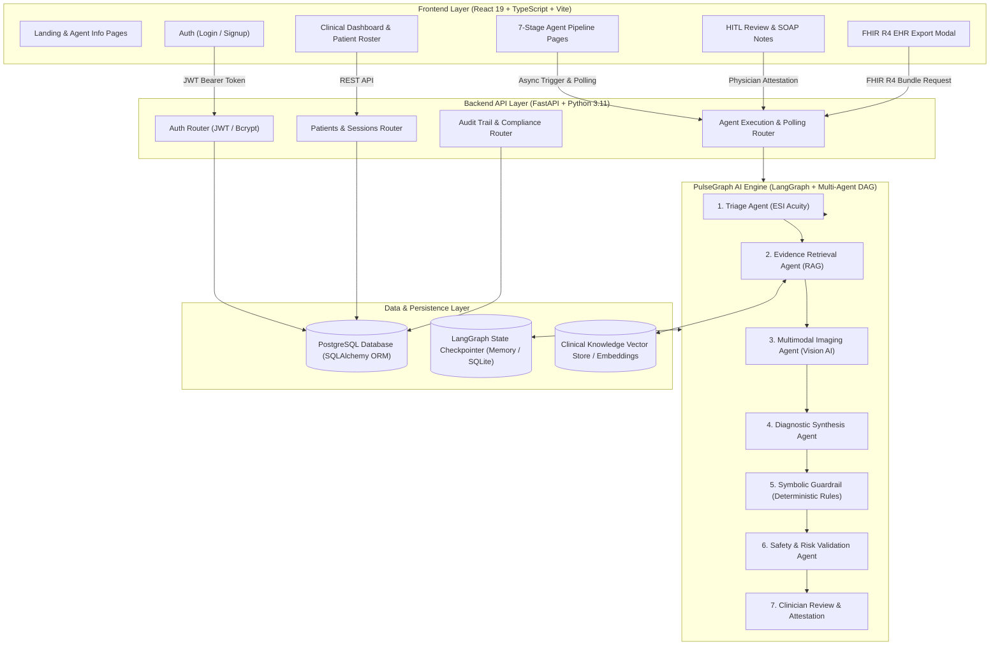
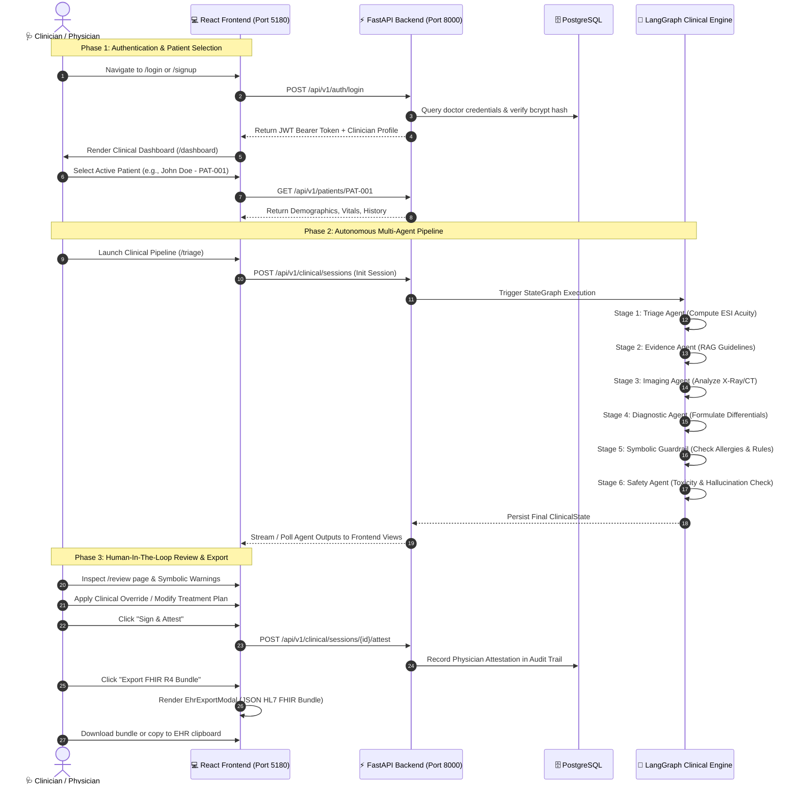

# PulseGraph AI: Complete User Flow, Architecture & Technical Documentation

---

## 1. Executive Summary & System Overview

**PulseGraph AI** is an enterprise-grade, multi-agent Clinical Decision Support System (CDSS) designed to assist physicians, triage nurses, and healthcare specialists in emergency and outpatient clinical settings. 

The platform implements a **Human-In-The-Loop (HITL)** architecture where autonomous clinical AI agents collaborate in a directed acyclic state graph (DAG) to evaluate patient intake data, retrieve medical literature, analyze medical imaging, formulate weighted differential diagnoses, and enforce deterministic clinical safety rules. The physician maintains absolute oversight and final sign-off authority at every stage.

### High-Level Architecture Diagram



---

## 2. Terminology & Core Concepts Glossary

| Term / Keyword | Definition & Role in PulseGraph AI |
| :--- | :--- |
| **CDSS (Clinical Decision Support System)** | Software application analyzing health data to provide healthcare providers with patient-specific diagnostic and treatment recommendations. |
| **HITL (Human-In-The-Loop)** | An architectural mandate where AI systems never execute autonomous clinical actions without explicit human physician review, modification, and signed attestation. |
| **LangGraph** | A stateful orchestration framework built on graph data structures where each agent node transitions the shared `ClinicalState` across conditional branching edges. |
| **Symbolic Guardrail** | A deterministic, non-probabilistic rule engine (zero LLM hallucinations) that enforces hard medical laws (e.g., drug-allergy contraindications, pediatric dose limits). |
| **RAG (Retrieval-Augmented Generation)** | A mechanism retrieving relevant clinical guidelines (PubMed, UpToDate, AHA/ACC) from a vector store to ground LLM reasoning with cited sources. |
| **ESI (Emergency Severity Index)** | A 5-level emergency department triage algorithm (Level 1: Resuscitation to Level 5: Non-urgent) computed deterministically and supplemented by AI. |
| **FHIR R4 (Fast Healthcare Interoperability Resources)** | An international HL7 standard for healthcare data exchange. PulseGraph AI exports sessions as standard JSON `Bundle`, `Patient`, `Observation`, and `DiagnosticReport` resources. |
| **SOAP Note** | A structured clinical documentation format consisting of **S**ubjective (symptoms), **O**bjective (vitals, labs, imaging), **A**ssessment (differential diagnosis), and **P**lan (interventions). |
| **JWT (JSON Web Token)** | A cryptographically signed token (HMAC-SHA256) carrying verified physician claims (Doctor ID, License Number, Department) for stateless API authentication. |
| **Bcrypt** | An adaptive cryptographic hash function incorporating salt and work factor to securely store clinician passwords against rainbow table and brute-force attacks. |
| **Checkpointer** | A persistent state mechanism in LangGraph that saves snapshots of the clinical graph at every agent transition, enabling session resumption and time-travel debugging. |

---

## 3. Technology Stack & Architectural Decision Matrix

Below is an exhaustive breakdown of every technology chosen across PulseGraph AI, compared against industry alternatives and the technical rationale for each choice.

### 3.1. Frontend Architecture

```
frontend/
├── src/
│   ├── api/          # Strongly typed Axios/Fetch HTTP clients
│   ├── components/   # Atomic UI & Common clinical components (Modals, Headers, Banners)
│   ├── context/      # React Contexts (AuthContext, WorkflowContext)
│   ├── pages/        # Route pages (Landing, Login, Dashboard, 7 Pipeline Pages, Audit)
│   ├── types/        # TypeScript interfaces matching backend Pydantic models
│   └── index.css     # Design tokens, CSS variables, glassmorphism, responsive grid
```

| Technology Chosen | Why Chosen Over Alternatives | Alternative Considered | Trade-off / Decision Rationale |
| :--- | :--- | :--- | :--- |
| **React 19 + TypeScript** | Strict type safety across clinical schemas, component reusability, rich ecosystem for medical data visualization. | Vanilla JavaScript, Vue, Svelte | Clinical software requires absolute type safety between backend schemas and frontend UI to prevent rendering bugs in critical metrics. |
| **Vite 6** | Sub-second Hot Module Replacement (HMR), Rollup-based tree-shaking, lightning-fast dev builds. | Create React App (CRA), Webpack | CRA is deprecated and slow. Webpack requires complex config. Vite provides instant server start and optimal ESM bundling. |
| **Custom CSS + Tailwind CSS (Hybrid Tokens)** | Glassmorphism, medical dark-mode design system, high-contrast accessibility (a11y), responsive micro-animations. | Component Libraries (Material UI, Ant Design, Bootstrap) | Generic UI kits look like template dashboards. PulseGraph AI requires a bespoke, dark-clinical theme with custom gradients, glowing status badges, and dense diagnostic viewports. |
| **Lucide React Icons** | Lightweight tree-shakeable SVG icons specifically covering medical, security, and workflow iconography. | FontAwesome, Heroicons | Zero-overhead modern SVG icons matching standard modern design languages. |

---

### 3.2. Backend & API Architecture

```
src/
├── agents/           # Specialized clinical agent implementations
├── api/              # FastAPI application, dependency injection, and REST routes
├── auth/             # Cryptographic password hashing, session tokens, JWT utilities
├── core/             # LangGraph state definition, graph builder, symbolic rule engine
├── db/               # PostgreSQL connection engine, SQLAlchemy ORM models, migrations
└── tools/            # Multimodal imaging models, RAG vector retrievers, external tools
```

| Technology Chosen | Why Chosen Over Alternatives | Alternative Considered | Trade-off / Decision Rationale |
| :--- | :--- | :--- | :--- |
| **FastAPI (Python 3.11)** | Native async/await concurrency, automatic OpenAPI/Swagger docs generation, native Pydantic schema validation. | Flask, Django, Express.js | Flask lacks native async and automatic documentation. Django is monolithic and heavy. Python is mandatory for AI/ML/LangGraph ecosystem. |
| **Pydantic v2** | Blazing-fast Rust-based data validation, strict clinical model serialization, automatic JSON schema generation. | Standard `dataclasses`, Marshmallow | Pydantic guarantees that malformed vital signs, corrupted lab values, or invalid diagnostic structures fail loudly at the API boundary. |
| **Uvicorn** | High-performance ASGI web server handling asynchronous requests and long-polling agent execution loops. | Gunicorn (sync workers), WSGI | Asynchronous non-blocking I/O is critical when clinical agents run multi-second LLM inferences or imaging analyses. |

---

### 3.3. Database & Persistence Layer

| Technology Chosen | Why Chosen Over Alternatives | Alternative Considered | Trade-off / Decision Rationale |
| :--- | :--- | :--- | :--- |
| **PostgreSQL + SQLAlchemy 2.0** | ACID compliance, relational integrity (Foreign Keys between Doctors, Patients, Sessions, Audit Logs), JSONB support. | MongoDB, Supabase, Firebase | Medical records require strict relational integrity and ACID guarantees. Relational constraints prevent orphaned patient sessions. PostgreSQL JSONB allows storing dynamic agent outputs while enforcing relational integrity on patient identifiers. |
| **LangGraph Checkpointer (`MemorySaver` / SQLite)** | Native thread and state versioning, snapshot isolation per clinical session. | Redis, Custom Mongo checkpoints | LangGraph checkpointers understand the exact state graph topology, allowing atomic state updates without writing custom persistence glue. |

---

### 3.4. AI, Multi-Agent Orchestration & Symbolic Rules

| Technology Chosen | Why Chosen Over Alternatives | Alternative Considered | Trade-off / Decision Rationale |
| :--- | :--- | :--- | :--- |
| **LangGraph Multi-Agent StateGraph** | Explicit cyclical and branching DAG control, deterministic routing, native Human-In-The-Loop interrupts. | CrewAI, AutoGen, LangChain Sequential Chains | AutoGen and CrewAI rely on conversational multi-agent banter that is non-deterministic and difficult to audit. LangGraph provides strict, state-machine transitions essential for clinical governance. |
| **Deterministic Symbolic Rule Engine** | 100% mathematical certainty for contraindications, dosage limits, and drug-allergy matching without LLM hallucination risk. | LLM-only validation | LLMs can hallucinate and miss life-threatening drug-allergy conflicts. The symbolic guardrail is hardcoded Python logic that intercepts and blocks dangerous proposals before physician review. |
| **BioMedCLIP / MedSigLIP / Vision-LLM** | Domain-specialized visual embeddings for chest X-rays, CT scans, and pathology images. | General CLIP, GPT-4V alone | General vision models lack medical anomaly training. Domain-specific medical vision models accurately identify pulmonary consolidations, cardiomegaly, and pneumothorax. |

---

## 4. Complete End-to-End User Flow (Step-by-Step)



---

### Step 1: Landing Page & Public Agent Explorer (`/`, `/agent-info/:agentId`)

```
Route: / (frontend/src/pages/landing/LandingPage.tsx)
Route: /agent-info/:agentId (frontend/src/pages/agent-info/AgentInfoPage.tsx)
```

1. **User Experience & Goal**:
   - A prospective clinician or hospital administrator lands on the site.
   - The landing page presents a dark-mode hero banner, an architecture overview of the 6 specialized AI agents, compliance badges (HIPAA, HL7 FHIR R4, HITL), and interactive agent cards.
   - Users can click on any agent card (e.g., "Triage Agent", "Symbolic Guardrail") to view a dedicated public information page explaining the agent's technical architecture, input/output schemas, and safety parameters without needing to log in.

2. **Underlying Code & Implementation**:
   - [LandingPage.tsx](file:///Users/chayankbhargava/Projects/PulseGraph%20AI/frontend/src/pages/landing/LandingPage.tsx): Renders feature cards with direct navigation links to `/agent-info/triage`, `/agent-info/symbolic`, etc.
   - [AgentInfoPage.tsx](file:///Users/chayankbhargava/Projects/PulseGraph%20AI/frontend/src/pages/agent-info/AgentInfoPage.tsx): Contains a static knowledge registry detailing each agent's algorithms, clinical reasoning steps, inputs, and outputs.

---

### Step 2: Clinician Authentication (Sign Up & Login) (`/signup`, `/login`)

```
Route: /login (frontend/src/pages/login/LoginPage.tsx)
Route: /signup (frontend/src/pages/signup/SignupPage.tsx)
API: POST /api/v1/auth/login (src/api/routes/auth.py)
API: POST /api/v1/auth/register (src/api/routes/auth.py)
```

1. **User Experience & Goal**:
   - The doctor logs in using their medical credentials (Email, Password, Department, and Medical License Number).
   - If registering, they fill in their full name, medical license, department (e.g., Emergency Medicine, Cardiology), and create a password.

2. **Security & Cryptography Implementation**:
   - **Password Hashing**: Stored in PostgreSQL using `passlib.context.CryptContext(schemes=["bcrypt"])`. Passwords are never stored or logged in plain text.
   - **Token Generation**: Upon verification, FastAPI issues a signed JWT token:
     ```python
     # src/auth/jwt.py
     token_payload = {
         "sub": doctor.doctor_id,
         "email": doctor.email,
         "name": doctor.full_name,
         "license_number": doctor.license_number,
         "department": doctor.department,
         "exp": datetime.now(timezone.utc) + timedelta(minutes=settings.access_token_expire_minutes)
     }
     access_token = jwt.encode(token_payload, settings.jwt_secret_key, algorithm="HS256")
     ```
   - **Client State**: [AuthContext.tsx](file:///Users/chayankbhargava/Projects/PulseGraph%20AI/frontend/src/context/AuthContext.tsx) stores the token in `localStorage`, decodes the clinician's identity, and attaches `Authorization: Bearer <token>` to all downstream Axios requests.

---

### Step 3: Clinical Workspace & Patient Management (`/dashboard`)

```
Route: /dashboard (frontend/src/pages/dashboard/DashboardPage.tsx)
Modals: PatientSelectionModal.tsx, PatientManagementModal.tsx
API: GET /api/v1/patients/ (src/api/routes/patients.py)
API: POST /api/v1/patients/ (src/api/routes/patients.py)
```

1. **User Experience & Goal**:
   - The physician lands on the clinical workspace showing active case statistics (Total Patients, Pending Reviews, High-Acuity Flags, Critical Lab Alerts).
   - The physician clicks **"Select Active Patient"** to launch [PatientSelectionModal.tsx](file:///Users/chayankbhargava/Projects/PulseGraph%20AI/frontend/src/components/common/PatientSelectionModal.tsx), searching by name, MRN (Medical Record Number), age, or triage severity.
   - The physician can also click **"New Patient Intake"** to open [PatientManagementModal.tsx](file:///Users/chayankbhargava/Projects/PulseGraph%20AI/frontend/src/components/common/PatientManagementModal.tsx), entering vital signs (BP, HR, SpO2, Temp, RR), allergies, chronic conditions, and chief complaint.

2. **State Management Synchronization**:
   - [WorkflowContext.tsx](file:///Users/chayankbhargava/Projects/PulseGraph%20AI/frontend/src/context/WorkflowContext.tsx) provides a global `selectPatient(patient)` method that resets pipeline statuses, fetches any existing active `ClinicalSession`, and updates the top workflow banner across all pages.

---

### Step 4: Multi-Agent Clinical Pipeline Execution

The doctor navigates through the 7-step pipeline via the persistent [WorkflowProgress.tsx](file:///Users/chayankbhargava/Projects/PulseGraph%20AI/frontend/src/components/common/WorkflowProgress.tsx) navigation bar.

#### Stage 1: Triage & Acuity Categorization (`/triage`)
- **File**: [TriagePage.tsx](file:///Users/chayankbhargava/Projects/PulseGraph%20AI/frontend/src/pages/triage/TriagePage.tsx) | Backend: [src/agents/triage.py](file:///Users/chayankbhargava/Projects/PulseGraph%20AI/src/agents/triage.py)
- **What it does**: 
  - Analyzes chief complaint and baseline vital signs.
  - Computes the **ESI (Emergency Severity Index 1 to 5)**.
  - Identifies immediate **Red Flag Symptoms** (e.g., hemodynamic instability, severe hypoxemia, chest pain radiating to left arm).
- **Tech & Algorithms**: Deterministic threshold checks for vitals (`HR > 120`, `SpO2 < 90%`, `SBP < 90`) combined with LLM semantic reasoning for unconstrained clinical narratives.

#### Stage 2: Evidence Retrieval & RAG (`/evidence`)
- **File**: [EvidencePage.tsx](file:///Users/chayankbhargava/Projects/PulseGraph%20AI/frontend/src/pages/evidence/EvidencePage.tsx) | Backend: [src/agents/evidence_rag.py](file:///Users/chayankbhargava/Projects/PulseGraph%20AI/src/agents/evidence_rag.py)
- **What it does**:
  - Extracts key clinical entities from the patient profile.
  - Queries indexed clinical vector stores (PubMed, AHA/ACC guidelines, UpToDate summaries).
  - Renders citation cards with relevance scores, medical journal sources, and extracted clinical snippets.
- **Tech**: Vector embeddings, cosine similarity search, citation verification engine.

#### Stage 3: Multimodal Imaging Analysis (`/imaging`)
- **File**: [ImagingPage.tsx](file:///Users/chayankbhargava/Projects/PulseGraph%20AI/frontend/src/pages/imaging/ImagingPage.tsx) | Backend: [src/agents/imaging.py](file:///Users/chayankbhargava/Projects/PulseGraph%20AI/src/agents/imaging.py)
- **What it does**:
  - Supports uploading Chest X-Ray, CT, or MRI images (DICOM / PNG / JPEG).
  - Executes deep vision models to detect pathological anomalies (e.g., "Right lower lobe consolidation", "Cardiomegaly", "Pneumothorax").
  - Computes confidence scores and provides visual bounding box / attention region breakdowns.
- **Tech**: BioMedCLIP / MedSigLIP multimodal vision embeddings, FastAPI multipart file upload streaming.

#### Stage 4: Diagnostic Synthesis & Differentials (`/diagnostic`)
- **File**: [DiagnosticPage.tsx](file:///Users/chayankbhargava/Projects/PulseGraph%20AI/frontend/src/pages/diagnostic/DiagnosticPage.tsx) | Backend: [src/agents/diagnostic.py](file:///Users/chayankbhargava/Projects/PulseGraph%20AI/src/agents/diagnostic.py)
- **What it does**:
  - Synthesizes findings from Triage, Evidence RAG, and Imaging.
  - Formulates a prioritized **Differential Diagnosis List** with probability weights (e.g., *Community-Acquired Pneumonia: 78%*, *Acute Coronary Syndrome: 12%*, *Pulmonary Embolism: 8%*).
  - Outlines supporting clinical findings vs contradictory observations.

#### Stage 5: Symbolic Guardrails (Deterministic Safety) (`/symbolic`)
- **File**: [SymbolicGuardPage.tsx](file:///Users/chayankbhargava/Projects/PulseGraph%20AI/frontend/src/pages/symbolic/SymbolicGuardPage.tsx) | Backend: [src/core/symbolic_rules.py](file:///Users/chayankbhargava/Projects/PulseGraph%20AI/src/core/symbolic_rules.py), [src/agents/symbolic_guardrail.py](file:///Users/chayankbhargava/Projects/PulseGraph%20AI/src/agents/symbolic_guardrail.py)
- **What it does**:
  - Validates proposed diagnoses and medications against strict medical rules:
    1. **Allergy-Drug Cross-Reactivity** (e.g., Penicillin allergy vs Amoxicillin proposal).
    2. **Drug-Drug Interactions** (e.g., Sildenafil + Nitroglycerin = Fatal hypotension).
    3. **Pediatric / Geriatric Dose Limits**.
    4. **Vital Sign Contraindications** (e.g., Beta-blockers when `HR < 50`).
- **Why Symbolic**: Zero AI hallucination risk. Rules are evaluated as pure boolean AST logic.

#### Stage 6: Safety & Risk Validation (`/safety`)
- **File**: [SafetyPage.tsx](file:///Users/chayankbhargava/Projects/PulseGraph%20AI/frontend/src/pages/safety/SafetyPage.tsx) | Backend: [src/agents/safety.py](file:///Users/chayankbhargava/Projects/PulseGraph%20AI/src/agents/safety.py)
- **What it does**:
  - Scores the overall plan on Clinical Confidence (0-100%), Hallucination Risk Index, and Guideline Compliance.
  - Generates an actionable safety checklist before human physician handoff.

#### Stage 7: Human-In-The-Loop (HITL) Review & Physician Attestation (`/review`)
- **File**: [ReviewPage.tsx](file:///Users/chayankbhargava/Projects/PulseGraph%20AI/frontend/src/pages/review/ReviewPage.tsx) | Component: [ReviewActionBar.tsx](file:///Users/chayankbhargava/Projects/PulseGraph%20AI/frontend/src/components/common/ReviewActionBar.tsx)
- **What it does**:
  - Consolidates the complete multi-agent deliberation into a structured **SOAP Note**.
  - Allows the physician to edit the assessment, add manual notes, or explicitly override a symbolic guardrail warning with mandatory clinical justification.
  - The physician enters their PIN / credentials and clicks **"Sign & Attest Case"**, locking the session into an immutable record.

---

### Step 5: Clinical Data Requests & Interactivity

```
Component: frontend/src/components/common/DataRequestModal.tsx
Backend: src/core/data_requests.py
```

- If the AI engine identifies insufficient diagnostic information (e.g., "Troponin-I required to rule out NSTEMI" or "D-Dimer required for suspected PE"), it initiates a **Data Request**.
- The frontend displays an alert badge and opens [DataRequestModal.tsx](file:///Users/chayankbhargava/Projects/PulseGraph%20AI/frontend/src/components/common/DataRequestModal.tsx).
- The doctor enters the lab value or uploads the test result, which resolves the block and triggers LangGraph to resume graph execution with updated state.

---

### Step 6: HL7 FHIR R4 EHR Export (`EhrExportModal.tsx`)

```
Component: frontend/src/components/common/EhrExportModal.tsx
Standard: HL7 FHIR Release 4 (JSON Format)
```

- The physician clicks **"Export to EHR (FHIR R4)"** from the review workbench.
- The modal generates an interoperable FHIR bundle containing:
  1. `Bundle` (type: `document` with cryptographic timestamp).
  2. `Patient` resource (MRN, Demographics, Gender, Age).
  3. `Observation` resources (Heart Rate, Blood Pressure, Respiratory Rate, SpO2).
  4. `DiagnosticReport` resource (Differential diagnoses, AI Confidence, Imaging findings).
  5. `Practitioner` resource (Attending physician, License number, Digital signature).
- Clinicians can copy the JSON or download the `.fhir.json` file for import into Epic, Cerner, or hospital EHR systems.

---

### Step 7: Audit Trail & Compliance Timeline (`/audit`)

```
Route: /audit (frontend/src/pages/audit/AuditPage.tsx)
Component: frontend/src/components/common/AuditTimeline.tsx
Backend: src/api/routes/clinical.py
```

- Every interaction is recorded in PostgreSQL with timestamp, actor (`AI_AGENT` vs `PHYSICIAN`), event type (`STATE_INITIALIZATION`, `SYMBOLIC_VIOLATION`, `CLINICAL_OVERRIDE`, `PHYSICIAN_ATTESTATION`), and state payload diff.
- The audit timeline ensures full legal, forensic, and HIPAA compliance for AI-assisted clinical decisions.

---

## 5. Summary Architecture Blueprint

| Layer | Technologies Used | Core Responsibilities |
| :--- | :--- | :--- |
| **Presentation (UI/UX)** | React 19, TypeScript, Vite, Custom Glassmorphism CSS, Tailwind, Lucide React, React Router v7 | Responsive clinical interface, multi-page agent pipeline, real-time status banners, modal dialogues, FHIR export viewer. |
| **State & Context** | React Context (`AuthContext`, `WorkflowContext`), Browser LocalStorage | JWT lifecycle, active patient selection, active session state caching, polling coordination. |
| **API Gateway** | FastAPI, Uvicorn, Pydantic v2, Python `jose` (JWT), `passlib` (Bcrypt) | REST endpoints, authentication dependencies, request validation, async execution triggers. |
| **Agent Orchestration** | LangGraph, LangChain Core, StateGraph, MemorySaver Checkpointer | Directed acyclic multi-agent graph, state transitions, conditional branching, human interrupts. |
| **Deterministic Safety** | Python Symbolic AST Rule Engine, Rule Matchers | Non-probabilistic verification of drug-allergy contraindications, drug interactions, and dosage safety. |
| **Multimodal Vision** | BioMedCLIP / MedSigLIP, PyTorch / TorchVision | Deep learning feature extraction on medical radiographs, CT scans, and pathology imagery. |
| **Data Persistence** | PostgreSQL, SQLAlchemy 2.0 ORM, SQLite (local fallback) | ACID relational storage for doctor profiles, patient registries, clinical sessions, and audit events. |
| **Interoperability** | HL7 FHIR R4 JSON standard | Exporting standardized electronic health records compatible with hospital EHR systems. |

---

## 6. Comprehensive Technical Interview Question & Answer Bank

This section contains an exhaustive index of interview questions categorized by architectural layer, domain, and seniority level (Junior to Principal/Staff Engineer). Each question includes the **underlying motivation**, **key concepts/keywords to highlight**, and the **ideal answer / talking points** referencing PulseGraph AI.

---

### Category 1: Multi-Agent Systems & LangGraph Architecture

#### Q1.1: Why did you choose LangGraph over other multi-agent frameworks like AutoGen, CrewAI, or simple sequential LangChain chains?
- **Why Interviewers Ask**: Tests understanding of multi-agent state machines, determinism, and clinical safety constraints.
- **Key Concepts**: Cyclical vs Acyclic Graphs, StateGraph, Shared State Mutability, Deterministic Transitions, Human-In-The-Loop Interrupts (`interrupt_before` / `interrupt_after`).
- **Talking Points**:
  - *AutoGen / CrewAI*: Built around conversational agent banter (agent-to-agent LLM chatting). In clinical decision support, conversational banter introduces nondeterministic loops, high token latency, and hallucination risks that cannot be formally verified.
  - *LangChain Sequential Chains*: Too rigid. Healthcare workflows require conditional branching (e.g., if imaging is missing, trigger a `DataRequest`; if symbolic safety fails, route back to diagnostics or halt at HITL).
  - *LangGraph*: Operates as a formal Finite State Machine (FSM) over a typed `ClinicalState`. Nodes are pure transition functions, edges are explicit deterministic conditionals, and state snapshots can be persisted at every boundary.

#### Q1.2: How does state management work in LangGraph, and how do you prevent race conditions when multiple agents attempt to modify state?
- **Why Interviewers Ask**: Assesses knowledge of concurrency, state mutability, and reducer patterns.
- **Key Concepts**: `TypedDict` / Pydantic State, State Reducers (`Annotated[list, operator.add]`), Atomic Node Execution.
- **Talking Points**:
  - The `ClinicalState` is defined as a central Pydantic model containing isolated sub-states (`triage_output`, `evidence_data`, `imaging_findings`, `differential_diagnoses`, `symbolic_violations`).
  - In LangGraph, nodes execute sequentially or via explicit parallel fan-out. State keys that accumulate data use custom reducer annotations to append new observations without overwriting prior agent deductions.
  - Snapshot isolation ensures that each agent reads a consistent state view at time $T$ and returns only its delta dictionary.

#### Q1.3: How does PulseGraph AI implement Human-In-The-Loop (HITL) at the graph level?
- **Why Interviewers Ask**: Tests understanding of asynchronous execution suspension and resume workflows in agent systems.
- **Key Concepts**: Graph Checkpointing (`MemorySaver` / SQLite), Thread ID, Graph Interrupts, State Resumption with Human Payloads.
- **Talking Points**:
  - We configure `interrupt_before=["hitl_review_node"]` or use dynamic interrupts when a mandatory lab is missing (`DataRequest`).
  - When the graph reaches the interrupt node, execution pauses, and the checkpointer saves the entire state under the active `thread_id` (session ID).
  - The frontend polls or receives an alert, allowing the physician to inspect the state, edit the SOAP note, or provide missing inputs.
  - Once the physician submits their attestation or lab input, the API calls `graph.update_state()` and resumes execution via `graph.stream(None, thread_config)`.

#### Q1.4: How do you prevent infinite loops or runaway execution in cyclic agent graphs?
- **Why Interviewers Ask**: Gauges practical experience with autonomous agent failure modes.
- **Key Concepts**: Recursion Limit (`recursion_limit`), Max Iteration Counters, Guardrail Fallback Nodes.
- **Talking Points**:
  - We enforce a strict `MAX_ITERATIONS` constant (e.g., `max_iterations = 3`) within the `ClinicalState`.
  - Conditional edge functions check `state.iteration_count >= MAX_ITERATIONS`. If reached, the graph deterministically breaks the loop and routes directly to the Safety / Human Review node with a warning flag: `"Max automated iterations exceeded; routing to manual physician review"`.

---

### Category 2: Deterministic Symbolic AI & Clinical Guardrails

#### Q2.1: What is a "Symbolic Guardrail" and why can't we rely solely on LLMs with prompting (e.g., "Do not prescribe penicillin if allergic")?
- **Why Interviewers Ask**: Core differentiator question between naive wrapper apps and enterprise safety-critical systems.
- **Key Concepts**: Probabilistic vs Deterministic Verification, Zero-Shot Hallucination, AST (Abstract Syntax Tree), Drug-Allergy Cross-Reactivity, FDA Black Box Warnings.
- **Talking Points**:
  - LLMs are probabilistic token predictors ($\sim P(w_t | w_{<t})$). Even with temperature 0.0, an LLM has a non-zero probability of ignoring negative system constraints when distracted by long clinical context.
  - In healthcare, a 99.9% success rate means 1 fatal adverse event per 1,000 prescriptions—which is completely unacceptable.
  - PulseGraph AI uses a **Deterministic Symbolic Rule Engine** written in pure Python. It parses proposed medications and tests them against the patient's explicit allergy list and active drug profile using set intersection and hardcoded cross-reactivity tables (e.g., `Penicillins -> Amoxicillin/Ampicillin`). If a conflict exists, the symbolic engine returns an immutable rejection flag with zero probabilistic variance.

#### Q2.2: How are clinical overrides handled when a physician intentionally bypasses a symbolic safety warning?
- **Why Interviewers Ask**: Evaluates understanding of real-world clinical workflows and forensic accountability.
- **Key Concepts**: Clinical Justification Requirement, Mandatory Override Reason, Clinician Attribution, Non-Repudiation, Audit Logging.
- **Talking Points**:
  - In emergency medicine, physicians sometimes deliberately prescribe contraindicated drugs (e.g., giving epinephrine in severe anaphylaxis despite underlying tachyarrhythmia).
  - The system forbids silent dismissals. To override, the UI requires:
    1. Mandatory selection of an override category (e.g., *Benefit Outweighs Risk*, *Alternative Therapy Exhausted*).
    2. Free-text clinical justification notes.
    3. Re-entry of physician credentials / PIN.
  - This event is written to the immutable PostgreSQL audit log with `actor: PHYSICIAN`, `override_reason`, and timestamp.

---

### Category 3: Clinical RAG, Vector Search & Multimodal Imaging

#### Q3.1: How does your Retrieval-Augmented Generation (RAG) pipeline prevent medical hallucinations in clinical citations?
- **Why Interviewers Ask**: Tests depth in RAG architecture, semantic search, and grounding verification.
- **Key Concepts**: Semantic Chunking, Medical Ontologies (MeSH, ICD-10, SNOMED), Cosine Similarity Thresholds, Exact Quote Verification, Citation Attribution.
- **Talking Points**:
  - We extract structured clinical entities (e.g., *Chief Complaint: Dyspnea*, *Vitals: SpO2 88%*, *History: COPD*) before generating search queries.
  - Retrieved guideline passages from PubMed and ACC/AHA are passed to the synthesizer with strict prompting mandates: every diagnostic claim must include an inline bracket citation (`[Guideline-ID]`) matching an exact substring in the retrieved context.
  - Post-generation verification filters out any citation that lacks exact character-level grounding in the retrieved vector context.

#### Q3.2: How does the Multimodal Imaging Agent process radiographs, and what model architecture is used?
- **Why Interviewers Ask**: Assesses knowledge of multimodal vision models in specialized domains.
- **Key Concepts**: BioMedCLIP, MedSigLIP, Vision Transformers (ViT), DICOM parsing, Zero-Shot Medical Classification.
- **Talking Points**:
  - Standard vision models (like CLIP or general Vision LLMs) struggle with subtle radiologic densities. We utilize biomedical contrastive vision models (e.g., BioMedCLIP/MedSigLIP) pre-trained on paired medical images and radiology reports.
  - The agent preprocesses DICOM / high-resolution radiographs (windowing, contrast equalization, resizing to $224 \times 224$ / $384 \times 384$).
  - It generates embedding vectors for visual abnormalities and computes similarity against prompt templates (e.g., `"chest radiograph showing pleural effusion"`, `"normal lung parenchyma"`), outputting calibrated probability scores.

---

### Category 4: Backend Engineering, FastAPI & Asynchronous Concurrency

#### Q4.1: Why use FastAPI over Django or Flask for this project?
- **Why Interviewers Ask**: Evaluates backend architecture selection criteria.
- **Key Concepts**: ASGI vs WSGI, Asynchronous Non-Blocking I/O, Pydantic Type Validation, Native OpenAPI 3.0 / Swagger, Dependency Injection.
- **Talking Points**:
  - **Async I/O**: AI agents perform high-latency I/O operations (calling external LLM APIs, vector DB lookups, running GPU inferences). FastAPI runs on `asyncio` and ASGI (Uvicorn), enabling the server to handle concurrent incoming requests while waiting for agent I/O without blocking worker threads.
  - **Pydantic v2 Integration**: FastAPI natively uses Pydantic for request/response serialization. Invalid clinical data (e.g., a negative heart rate or missing MRN) is rejected at the HTTP boundary before reaching business logic.
  - **Automated Interactive Docs**: Live interactive API documentation at `/docs` speeds up frontend-backend integration and automated QA contract testing.

#### Q4.2: How does authentication and authorization work across clinical endpoints?
- **Why Interviewers Ask**: Tests web security, JWT implementation, and role-based access control (RBAC).
- **Key Concepts**: JWT (HMAC-SHA256), `HTTPBearer` OAuth2 scheme, `passlib` Bcrypt, FastAPI `Depends()` sub-dependencies.
- **Talking Points**:
  - On `/api/v1/auth/login`, passwords are verified against bcrypt salted hashes.
  - A signed JWT token is issued containing the doctor's `doctor_id`, `license_number`, and `department` with a configurable expiration time (e.g., 60 minutes).
  - Protected endpoints inject the `get_current_doctor` dependency:
    ```python
    @router.post("/sessions/{session_id}/attest")
    async def attest_session(
        session_id: str,
        payload: AttestationPayload,
        current_doctor: Doctor = Depends(get_current_active_doctor),
        db: Session = Depends(get_db)
    ):
        # Authenticated doctor is cryptographically bound to the audit record
        ...
    ```

---

### Category 5: Database Engineering & Persistence

#### Q5.1: Why PostgreSQL over MongoDB or Firebase for PulseGraph AI?
- **Why Interviewers Ask**: Classic database design trade-off question with regulatory/clinical implications.
- **Key Concepts**: ACID Transactions, Foreign Key Constraints, Relational Integrity, JSONB hybrid storage, HIPAA Auditability.
- **Talking Points**:
  - **Relational Integrity**: Healthcare data is inherently relational. A `Session` must belong to a valid `Patient`, and an `Attestation` must reference a certified `Doctor`. Document stores (MongoDB) can lead to orphaned records and data inconsistency across clinical entities.
  - **ACID Guarantees**: When updating a patient's vital signs and closing a clinical session simultaneously, database transactions must be atomic. PostgreSQL guarantees ACID compliance.
  - **Hybrid JSONB**: For dynamic AI agent outputs (which have semi-structured schemas), PostgreSQL's `JSONB` data type allows indexed, schema-flexible storage while maintaining strict relational constraints on IDs and foreign keys.

#### Q5.2: How is database connection pooling configured in production, and why does it matter?
- **Why Interviewers Ask**: Tests production reliability and scalability knowledge.
- **Key Concepts**: SQLAlchemy `create_engine`, `pool_size`, `max_overflow`, `pool_pre_ping`.
- **Talking Points**:
  - In [src/db/database.py](file:///Users/chayankbhargava/Projects/PulseGraph%20AI/src/db/database.py), we configure:
    ```python
    engine = create_engine(
        settings.database_url,
        pool_pre_ping=True,  # Tests connection liveness before checkout to prevent stale disconnects
        pool_size=10,        # Base pool of persistent connections
        max_overflow=20      # Burst capability for traffic spikes
    )
    ```
  - Without `pool_pre_ping=True`, long-running agent requests or database idle timeouts would cause silent `500 Internal Server Error` connection drops on subsequent queries.

---

### Category 6: Frontend Engineering & Clinical UI/UX

#### Q6.1: Why use React 19 + TypeScript + Vite instead of Next.js or a traditional MPA?
- **Why Interviewers Ask**: Tests frontend architecture decision-making and performance considerations.
- **Key Concepts**: SPA (Single Page App) vs SSR (Server-Side Rendering), Client-Side State Transitions, Zero Layout Shift, Vite HMR, Strict Typing.
- **Talking Points**:
  - **Client-Side SPA**: PulseGraph AI is an authenticated clinical dashboard/workstation. It does not require public Search Engine Optimization (SEO) for clinical workflows. An SPA provides seamless, instantaneous page transitions across the 7 pipeline stages without full-page reloads or layout thrashing.
  - **TypeScript Strictness**: Interfaces in [types/clinical.ts](file:///Users/chayankbhargava/Projects/PulseGraph%20AI/frontend/src/types/clinical.ts) are strictly aligned with backend Pydantic models, eliminating `undefined is not a function` runtime errors when rendering complex nested medical differentials.
  - **Vite**: Sub-second dev build times and Rollup-optimized production chunks.

#### Q6.2: How do you handle real-time agent execution feedback on the frontend?
- **Why Interviewers Ask**: Evaluates real-time communication patterns (Polling vs WebSockets vs Server-Sent Events).
- **Key Concepts**: Interval Polling with Exponential Backoff, Server-Sent Events (SSE), WebSockets, Optimistic UI Updates.
- **Talking Points**:
  - When the physician triggers an agent run, the frontend initiates an asynchronous job and transitions the agent's badge to `"RUNNING"`.
  - [WorkflowContext.tsx](file:///Users/chayankbhargava/Projects/PulseGraph%20AI/frontend/src/context/WorkflowContext.tsx) manages an active polling hook targeting `/api/v1/clinical/sessions/{id}` with state comparison to detect status transitions (`IDLE` -> `RUNNING` -> `COMPLETED` / `FAILED`).
  - *Future roadmap optimization*: Replacing polling with Server-Sent Events (SSE) for unidirectional streaming of intermediate agent thought tokens.

---

### Category 7: Healthcare Interoperability, FHIR R4 & Compliance

#### Q7.1: What is HL7 FHIR R4 and how does PulseGraph AI construct a FHIR-compliant export?
- **Why Interviewers Ask**: Demonstrates real-world health tech domain expertise and standards adherence.
- **Key Concepts**: FHIR Release 4, JSON Schema, Resource Types (`Bundle`, `Patient`, `Observation`, `DiagnosticReport`, `Practitioner`), Coding Systems (LOINC, SNOMED CT, RxNorm).
- **Talking Points**:
  - FHIR (Fast Healthcare Interoperability Resources) is the global standard for electronic health record exchange mandated by the 21st Century Cures Act.
  - In [EhrExportModal.tsx](file:///Users/chayankbhargava/Projects/PulseGraph%20AI/frontend/src/components/common/EhrExportModal.tsx), PulseGraph AI serializes the session into a `Bundle` of type `document`.
  - Vital signs are mapped to standard LOINC codes (e.g., `8867-4` for Heart Rate, `8480-6` for Systolic BP).
  - Diagnostic outcomes are exported as `DiagnosticReport` resources linked to the attending `Practitioner` via cryptographic references.

#### Q7.2: How does the system address HIPAA compliance and patient data privacy?
- **Why Interviewers Ask**: Regulatory compliance is non-negotiable in digital health applications.
- **Key Concepts**: PHI (Protected Health Information), De-identification / Anonymization (Safe Harbor Method), Encryption in Transit (TLS 1.3) and at Rest (AES-256), Audit Trails.
- **Talking Points**:
  - **Transport Security**: All HTTP communication is enforced over TLS 1.3.
  - **No Plaintext Passwords**: Passwords hashed with bcrypt.
  - **PII Scrubbing**: Patient names and identifiers can be tokenized/de-identified before transmitting clinical narratives to cloud LLM inference endpoints.
  - **Immutable Audit Logging**: Every view, edit, override, and attestation is timestamped in the audit log for forensic traceability.

---

### Category 8: System Design, Failure Scenarios & Edge Cases

#### Q8.1: What happens if an external LLM API (e.g., OpenAI / Gemini) times out or experiences an outage during triage?
- **Why Interviewers Ask**: Tests resilience, fault tolerance, and graceful degradation strategies.
- **Key Concepts**: Circuit Breaker Pattern, Fallback Heuristics, Exponential Backoff, Graceful Degradation.
- **Talking Points**:
  - We implement a **Tiered Triage Fallback**:
    1. *Primary*: LLM-augmented semantic triage with contextual reasoning.
    2. *Secondary / Fallback*: Deterministic rule-based ESI algorithm evaluating only numeric vital signs and hardcoded emergency keyword triggers (e.g., `"chest pain" + HR > 110 -> ESI 2`).
  - If the LLM provider returns a `503 Service Unavailable` or times out (> 10s), the triage agent automatically falls back to the deterministic ESI calculator and attaches a metadata flag: `triage_mode: "DETERMINISTIC_FALLBACK"`.

#### Q8.2: If you had to scale this system to 100,000 concurrent hospital sessions, what architectural bottlenecks would you address first?
- **Why Interviewers Ask**: Assesses high-level distributed systems thinking and scalability limits.
- **Key Concepts**: Celery / Redis Task Queues, GPU Worker Pools, PostgreSQL Read Replicas, Caching with Redis, Horizontal Pod Autoscaling (HPA).
- **Talking Points**:
  1. **Decouple Agent Execution**: Move agent executions out of FastAPI web server processes into an asynchronous worker pool (Celery / Temporal / RabbitMQ).
  2. **Dedicated Inference Serving**: Host biomedical vision and LLM models on dedicated GPU clusters (vLLM / Triton Inference Server) with dynamic request batching.
  3. **State Checkpointer Offloading**: Replace local memory/SQLite checkpointers with a distributed Redis / DynamoDB cluster for sub-millisecond graph state checkpoint lookups.
  4. **Database Read Replicas**: Deploy PostgreSQL read replicas for intensive analytics queries, audit log exports, and patient roster searches.

