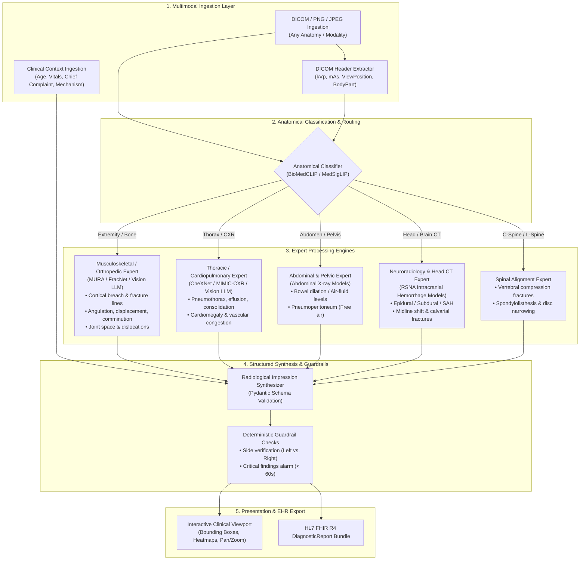

# PulseGraph AI: Universal Multimodal Imaging Agent Specification

---

## 1. Executive Summary & Vision

The **Universal Multimodal Imaging Agent** is an autonomous, modality-agnostic medical vision system engineered for clinical decision support. Unlike specialized models restricted to single-organ radiographs (such as chest-only X-rays), the Universal Imaging Agent can ingest, classify, analyze, and synthesize diagnostic findings across **any anatomical region and radiographic modality**—ranging from orthopedic extremity fractures (e.g., femur, wrist, clavicle) to chest radiographs, abdominal obstruction series, spine X-rays, and emergency non-contrast head CTs.

The system integrates **Medical Vision-Language Models (VLMs)** with a **Mixture-of-Experts (MoE)** routing topology, producing structured, standardized radiologist-grade impressions grounded in DICOM metadata and patient clinical context.

---

## 2. High-Level Architecture & Pipeline



---

## 3. Supported Modalities, Anatomies & Target Pathologies

| Anatomical Domain | Radiographic Modalities | Target Pathologies & Anomalies Detected | Underlying Reference Benchmarks |
| :--- | :--- | :--- | :--- |
| **Musculoskeletal & Orthopedics** | X-Ray (AP, Lateral, Oblique), CT Extremity | • Acute fractures (Femur, Tibia, Humerus, Radius/Ulna, Clavicle, Pelvis)<br>• Fracture characterization (Displaced, Comminuted, Greenstick, Pathologic)<br>• Joint dislocations & subluxations (Shoulder, Hip, Patella)<br>• Osteolytic/osteoblastic lesions & periosteal reactions | Stanford MURA, FracNet, DeepLesion |
| **Thoracic & Cardiopulmonary** | Chest X-Ray (PA, AP portable, Lateral) | • Pneumothorax & tension physiology<br>• Pleural effusion & hemothorax<br>• Lobar consolidations / Pneumonia<br>• Cardiomegaly (CTR > 0.55)<br>• Pulmonary edema / Kerley B lines<br>• Mediastinal widening / Aortic dissection | NIH ChestX-ray14, MIMIC-CXR, CheXNet |
| **Abdominal & Gastrointestinal** | Abdominal X-Ray (KUB, Erect, Supine), CT Abdomen | • Small/Large bowel obstruction (dilated loops > 3cm / > 6cm)<br>• Pneumoperitoneum (Free air under diaphragm)<br>• Radiopaque renal/ureteral calculi & gallstones<br>• Toxic megacolon & bowel wall thickening | DeepAbdomen, RSNA Abdominal Trauma |
| **Neuroradiology & Craniofacial** | Non-contrast Head CT, Skull X-Ray | • Intracranial hemorrhage (Epidural, Subdural, Subarachnoid, Intraparenchymal)<br>• Midline shift & brain herniation<br>• Calvarial and facial bone fractures | RSNA Brain Hemorrhage, CQ500 |
| **Spine & Neuro-axial** | Spine X-Ray (C-Spine, T-Spine, L-Spine), Spine CT | • Vertebral body compression fractures<br>• Spinous process & facet fractures<br>• Spondylolisthesis / Retrolisthesis<br>• Significant disc space narrowing | SpineWeb, RSNA Lumbar Spine |

---

## 4. UI/UX Clinical Viewport Design

When a clinician inspects an ingested radiograph in the frontend, the Universal Imaging Agent provides a dense, radiologist-grade workstation interface:

### 1. Header Metadata & Modality Badge
- **Modality Auto-Detected:** `LOWER_EXTREMITY_XRAY_AP_LATERAL`
- **Anatomical Target:** `Right Femur (Diaphysis / Mid-Shaft)`
- **Exposure / Technique:** `Diagnostic Quality (Adequate Penetration)`
- **Laterality Tag:** `RIGHT SIDE [Verified via DICOM Tag 0020,0062]`

### 2. Interactive Tooling Canvas
- **Contrast & Windowing:** Bone Window, Soft Tissue Window, Lung Window, Inverted (Black Bone) Mode.
- **Measurement Overlays:** Fracture displacement scale (mm), Cobb angle calculator, Cardiothoracic ratio (CTR) ruler.
- **Bounding Box & Attention Maps:** Colored segmentation boundaries outlining cortical breaks, opacities, or abnormal gas collections with toggleable confidence labels.

### 3. Structured Findings Matrix (Table)
```
+--------------------------+-------------------------------------------------------------+------------+------------+
| Anatomical Structure     | Radiographic Finding                                        | Severity   | Confidence |
+--------------------------+-------------------------------------------------------------+------------+------------+
| Right Femoral Shaft      | Complete transverse fracture through mid-diaphysis with    | CRITICAL   | 97.4%      |
|                          | 14mm lateral displacement and 10-degree apex-medial angul.  |            |            |
+--------------------------+-------------------------------------------------------------+------------+------------+
| Knee Joint (Distal)      | Intact distal femoral condyles; no intra-articular extension| NORMAL     | 99.1%      |
+--------------------------+-------------------------------------------------------------+------------+------------+
| Adjacent Soft Tissues    | Marked soft tissue swelling with localized hematoma shadow | HIGH       | 92.6%      |
+--------------------------+-------------------------------------------------------------+------------+------------+
```

### 4. Standardized Impression & Clinical Recommendations
> **Impression:**
> 1. Acute, complete, displaced transverse fracture of the mid-shaft of the right femur with 14mm displacement.
> 2. No intra-articular extension into the right knee or hip joints.
> 3. No secondary pathologic bone lesions.
>
> **Recommended Clinical Actions:**
> - Immediate orthopedic surgery consultation for open reduction and internal fixation (ORIF) / intramedullary nailing.
> - Neurovascular check of the right lower extremity (dorsalis pedis / posterior tibial pulses).
> - Adequate immobilization and analgesia.

---

## 5. Technical Implementation & Code Architecture

### 5.1. Universal Pydantic Data Schema

```python
# src/core/state.py (Universal Imaging Schema)
from pydantic import BaseModel, Field
from typing import List, Optional
from enum import Enum

class SeverityLevel(str, Enum):
    NORMAL = "NORMAL"
    LOW = "LOW"
    MODERATE = "MODERATE"
    HIGH = "HIGH"
    CRITICAL = "CRITICAL"

class ImagingFinding(BaseModel):
    finding_name: str = Field(..., description="Name of pathology (e.g. Femur Mid-shaft Fracture, Pneumothorax)")
    anatomy_subregion: str = Field(..., description="Specific sub-region (e.g. Mid-diaphysis, Right Upper Lobe)")
    confidence: float = Field(..., ge=0.0, le=1.0, description="Model prediction confidence score")
    clinical_significance: SeverityLevel
    measurements_mm: Optional[float] = None
    displacement_angulation: Optional[str] = None

class UniversalImagingData(BaseModel):
    image_path: str
    modality: str = Field(..., description="e.g., EXTREMITY_XRAY, CHEST_XRAY_PA, ABDOMEN_KUB, HEAD_CT")
    body_part_examined: str = Field(..., description="e.g., FEMUR, THORAX, ABDOMEN, SKULL, C_SPINE")
    laterality: Optional[str] = Field(None, description="RIGHT, LEFT, BILATERAL, UNILATERAL")
    findings: List[ImagingFinding]
    impression: str
    critical_alert: bool = Field(default=False, description="True if life-threatening condition detected")
    recommended_interventions: List[str]
```

---

### 5.2. Unified Agent Node Implementation

```python
# src/agents/universal_imaging.py
import json
import logging
from typing import Dict, Any
from src.core.state import ClinicalState, UniversalImagingData, SeverityLevel

logger = logging.getLogger("PulseGraph.UniversalImagingAgent")

SYSTEM_PROMPT = """
You are a Board-Certified Radiologist and Director of Emergency Radiology.
Analyze the provided medical radiograph/scan regardless of anatomical body part (Musculoskeletal, Thoracic, Abdominal, Neuroradiology, Spine).

Synthesize the patient's clinical context (Age, Chief Complaint, Mechanism of Injury, Vitals) with visual findings.
Output MUST be strict JSON conforming to the UniversalImagingData schema:
{
  "modality": "string",
  "body_part_examined": "string",
  "laterality": "RIGHT | LEFT | BILATERAL | N/A",
  "findings": [
    {
      "finding_name": "string",
      "anatomy_subregion": "string",
      "confidence": float (0.0 to 1.0),
      "clinical_significance": "NORMAL | LOW | MODERATE | HIGH | CRITICAL",
      "measurements_mm": float or null,
      "displacement_angulation": "string or null"
    }
  ],
  "impression": "string",
  "critical_alert": bool,
  "recommended_interventions": ["string"]
}
"""

async def universal_imaging_agent_node(state: ClinicalState) -> Dict[str, Any]:
    logger.info("Executing Universal Multimodal Imaging Agent...")

    image_path = state.get("image_path")
    patient_demographics = state.get("demographics", {})
    chief_complaint = patient_demographics.get("chief_complaint", "Unknown")

    if not image_path:
        logger.warning("No image path provided; returning unrecorded imaging state.")
        return {"imaging_data": None}

    # Ingest image bytes / DICOM
    with open(image_path, "rb") as img_file:
        image_bytes = img_file.read()

    # Invoke Frontier Vision LLM (e.g. Gemini 1.5 Pro / Flash Multimodal)
    user_prompt = f"""
    Patient Age: {patient_demographics.get('age')}
    Gender: {patient_demographics.get('gender')}
    Chief Complaint: {chief_complaint}
    Analyze the attached radiograph and produce full structured findings.
    """

    # Model inference execution (Async)
    response = await vision_model.generate_content([
        {"mime_type": "image/png", "data": image_bytes},
        SYSTEM_PROMPT,
        user_prompt
    ])

    parsed_json = json.loads(response.text)
    imaging_result = UniversalImagingData(**parsed_json)

    # If critical alert, update safety priority
    return {
        "imaging_data": imaging_result,
        "critical_imaging_finding": imaging_result.critical_alert
    }
```

---

## 6. Real-World Clinical Scenarios Comparison

### Scenario A: Orthopedic Trauma (Broken Femur)
- **Patient Profile:** 34M, High-speed motorcycle collision.
- **Input Image:** AP and Lateral Right Femur X-Ray (`femur_fracture_ap.dcm`).
- **Detected Modality:** `LOWER_EXTREMITY_XRAY`
- **Body Part:** `Right Femur`
- **Output:** Identifies comminuted shaft fracture with 14mm displacement. Recommends urgent orthopedic stabilization and neurovascular check.

### Scenario B: Cardiopulmonary Crisis (Tension Pneumothorax)
- **Patient Profile:** 58M, Sudden stabbing left chest pain, $SpO_2$ 84%, SBP 82 mmHg.
- **Input Image:** Portable AP Chest Radiograph (`cxr_tension_ptx.dcm`).
- **Detected Modality:** `CHEST_XRAY_AP_PORTABLE`
- **Body Part:** `Thorax`
- **Output:** Identifies large left tension pneumothorax with mediastinal shift to the right. Flags `critical_alert: True` (Immediate needle decompression indicated).

### Scenario C: Acute Abdomen (Bowel Perforation)
- **Patient Profile:** 72F, Severe diffuse abdominal pain, guarding, fever 38.9°C.
- **Input Image:** Erect Chest & Abdominal X-Ray (`erect_abd_free_air.dcm`).
- **Detected Modality:** `ABDOMEN_KUB_ERECT`
- **Body Part:** `Abdomen / Diaphragm`
- **Output:** Identifies free air (crescent of radiolucency) beneath the right hemidiaphragm (pneumoperitoneum). Flags emergency surgical consult.

---

## 7. Technical Interview Q&A on the Universal Imaging Agent

#### Q1: Why use a unified Vision-Language Model (VLM) rather than training separate convolutional neural networks for every single bone in the human body?
- **Answer:** Training isolated CNN classifiers for all 206 bones in the human body is brittle, requires millions of specialized annotations, and fails on multi-trauma patients with overlapping injuries. Modern Medical VLMs (like Med-Gemini / Gemini 1.5 Vision) leverage cross-anatomical visual representations, zero-shot generalization, and contextual grounding (combining age, trauma mechanism, and image features) within a single scalable pipeline.

#### Q2: How do you handle DICOM windowing (Hounsfield Units) when feeding CT scans into vision models that expect standard RGB pixels?
- **Answer:** Medical CT scans store raw attenuation values in Hounsfield Units (HU) ranging from $-1000$ (air) to $+3000$ (dense bone). The agent's ingestion pipeline applies specific linear window transformations $[W, L]$:
  - *Bone Window:* Window Width $W=2000$, Window Level $L=400$ (highlights fracture lines).
  - *Brain Window:* $W=80$, $L=40$ (highlights acute hemorrhage).
  - *Soft Tissue Window:* $W=400$, $L=50$.
  The agent generates a multi-channel composite tensor capturing multiple diagnostic windows simultaneously before passing it to the neural network.

#### Q3: How do you prevent orientation and laterality errors (e.g., misidentifying a Left Femur as a Right Femur)?
- **Answer:** The Universal Imaging Agent implements **Deterministic Laterality Triangulation**:
  1. Primary: Reads the DICOM Header tag `(0020,0062) Patient Orientation` and `(0018,5101) View Position`.
  2. Secondary: Executes OCR on radiopaque anatomical lead markers (`"R"` or `"L"` stamped on the radiograph).
  3. Tertiary: Verifies anatomical asymmetry (e.g., cardiac apex pointing left, liver shadow on the right).
  If any conflict is detected between the clinical intake notes and the radiographic marker, the agent raises a **Laterality Discrepancy Flag** before physician review.
